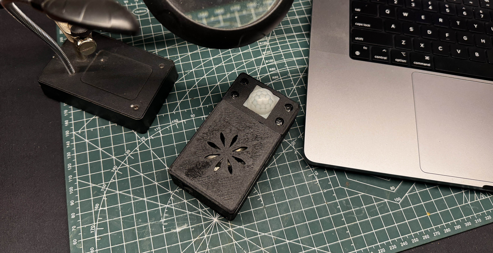

# Voice-Controlled Smart Home Assistant 🎙️🏠

[](https://opensource.org/licenses/MIT)
[](https://www.home-assistant.io/)
[](https://github.com/Aircoookie/WLED)

An intelligent IoT device built using the Maixduino Kit for AI + IoT, integrating voice recognition and motion detection to interact with Home Assistant via MQTT. The assistant recognizes specific voice commands, detects motion, and provides visual feedback through four white LEDs and two vertical RGB LED light bars. It updates the state of various entities in Home Assistant, enabling automation and enhancing user interaction with the smart home environment.

<div align="center">
  
</div>

## ✨ Key Features

- 🗣️ **Advanced Voice Recognition**: Custom-trained models with project-specific commands
- 📡 **Motion Detection**: PIR sensor technology for automated activation
- 💡 **Dynamic Visual Feedback**: 4 status LEDs + RGB light bars for clear system status
- 🏠 **Home Assistant Integration**: Comprehensive MQTT communication
- 🌙 **Smart Night Navigation**: Automatic lighting with motion detection
- ⚡ **Real-time State Management**: Instant updates and automation triggers
- 🛠️ **Easy Installation**: Non-destructive mounting and simple reset mechanism

## 📑 Table of Contents

- [Installation](#-installation)
- [Hardware Setup](#-hardware-setup)
- [Software Configuration](#-software-configuration)
- [Voice Model Generation](#-voice-model-generation)
- [Usage Guide](#-usage-guide)
- [Troubleshooting](#-troubleshooting)
- [Contributing](#-contributing)
- [License](#-license)

## 📦 Installation

### Hardware Requirements

Component | Purpose | Specifications
----------|----------|-------------
Maixduino Kit | Core Processing | AI + IoT version
ESP32 Module | Wi-Fi Communication | Built into Maixduino
PIR Sensor (HC-SR501) | Motion Detection | 3.3V compatible
Status LEDs | Visual Feedback | 4x white LEDs
Current Limiting Resistors | LED Protection | 4x 220Ω
RGB Light Bars | Dynamic Feedback | 2x 104 LED strips (1.5m)
ESP8266 | LED Control | WLED firmware
Power Supply | System Power | 12V DC barrel connector
Mounting Hardware | Installation | 3M Command Strips
Reset Wires | Easy Access | 2x insulated wires

### Hardware Assembly

1. **Power Connections**
   ```
   12V DC → Maixduino barrel jack
   GND → Common ground bus
   ```

2. **Sensor Wiring**
   ```
   PIR VCC → 3.3V
   PIR GND → GND
   PIR OUT → D8
   ```

3. **Status LEDs**
   ```
   System LED  → D5 + 220Ω → GND
   Speech LED  → D4 + 220Ω → GND
   Network LED → D3 + 220Ω → GND
   Motion LED  → D2 + 220Ω → GND
   ```

4. **Light Bars**
   - Mount vertically using Command Strips
   - Connect to ESP8266 running WLED
   - Power via 12V supply

5. **Reset Access**
   - Connect wire 1 to Reset pin
   - Connect wire 2 to GND pin
   - Route both wires through case opening
   - Insulate exposed ends
   - Label wires clearly

## 🎤 Voice Model Generation

### Prerequisites
- Maixduino Kit
- USB Cable
- CoolTerm Software
- Python 3.x Environment

### Voice Recording Environment Setup

1. **Physical Setup**
   - Install device in final location
   - Ensure case is fully assembled
   - Position at intended height
   - Verify proper ventilation

2. **Recording Environment**
   - Minimize background noise
   - Maintain consistent ~50cm distance
   - Use normal speaking voice
   - Test acoustics of space

### CoolTerm Configuration

1. **Initial Setup**
   ```
   Port: Select Maixduino COM port
   Baud Rate: 115200
   Data Bits: 8
   Stop Bits: 1
   Parity: None
   ```

2. **Buffer Settings**
   - Set buffer size to 75000
   - Enable "Capture to Text File"
   - Clear buffer between recordings

### Reset Procedure for Voice Model Recording

1. **Preparation**
   - Locate labeled reset and GND wires
   - Ensure clean wire ends
   - Have recording script ready

2. **Recording Process**
   - Touch reset and GND wires together briefly
   - Wait for LED confirmation of reboot
   - Begin recording when prompted
   - Maintain consistent voice level
   - Complete all 6 samples
   - Save file with descriptive name

3. **Safety Notes**
   - Keep wire ends separated when not in use
   - Consider adding small connectors
   - Avoid touching other components
   - Keep wires away from interference sources

### Project-Specific Voice Commands

Command ID | Phrase | Function | Description
-----------|--------|----------|-------------
1 | "Alfred Let's Go" | System Activation | Initializes main system functions
2 | "Bye Bye Jarvis" | System Shutdown | Graceful shutdown sequence
3 | "Cooking Mode" | Kitchen Control | Activates kitchen-specific settings
4 | "Goodnight Jarvis" | Night Mode | Evening shutdown routine
5 | "Jarvis Good Morning" | Morning Mode | Morning activation sequence
6 | "Jarvis Lights On" | Lighting Control | Activates configured lights
7 | "Lights Off Jarvis" | Lighting Control | Deactivates all lights
8 | "Wake Up Jarvis" | System Wake | Resumes from sleep mode
9 | "Clap Clap" | Attention Mode | Quick system attention
10 | "Jarvis Demo Mode" | Demonstration | Shows system capabilities

## 💻 Software Configuration

### MQTT Topics Structure
```cpp
// System State Topics
const char* motion_state_topic = "home-assistant/voice-control/motion/state";
const char* alfred_state_topic = "home-assistant/voice-control/alfred/state";
const char* system_state_topic = "home-assistant/voice-control/system/state";
const char* cooking_state_topic = "home-assistant/voice-control/cooking/state";
const char* goodnight_state_topic = "home-assistant/voice-control/goodnight/state";
const char* goodmorning_state_topic = "home-assistant/voice-control/goodmorning/state";
const char* light_state_topic = "home-assistant/voice-control/light/state";
```

### Home Assistant Configuration
```yaml
# MQTT Configuration
mqtt:
  binary_sensor:
    - name: "Voice Control Motion"
      state_topic: "home-assistant/voice-control/motion/state"
      device_class: "motion"
      unique_id: "voice-control-motion"

  switch:
    - name: "Alfred Mode"
      state_topic: "home-assistant/voice-control/alfred/state"
      unique_id: "voice-control-alfred"
      icon: "mdi:butler"
    
    - name: "Voice Control System"
      state_topic: "home-assistant/voice-control/system/state"
      unique_id: "voice-control-system"
      icon: "mdi:voice"
    
    - name: "Cooking Mode"
      state_topic: "home-assistant/voice-control/cooking/state"
      unique_id: "voice-control-cooking"
      icon: "mdi:stove"
    
    - name: "Goodnight Mode"
      state_topic: "home-assistant/voice-control/goodnight/state"
      unique_id: "voice-control-goodnight"
      icon: "mdi:weather-night"
    
    - name: "Good Morning Mode"
      state_topic: "home-assistant/voice-control/goodmorning/state"
      unique_id: "voice-control-goodmorning"
      icon: "mdi:weather-sunny"
    
    - name: "Voice Control Light"
      state_topic: "home-assistant/voice-control/light/state"
      unique_id: "voice-control-light"
      icon: "mdi:lightbulb"
```

## 🎯 Usage Guide

### Basic Operation
1. Power-up sequence initiates automatically
2. System LED indicates ready state
3. Motion detection activates voice recognition
4. Voice commands trigger corresponding actions
5. Light bars provide visual confirmation
6. Status LEDs show current system state

### Night Navigation
- Motion triggers soft lighting
- Auto-off after 4 seconds
- Adjustable sensitivity via Home Assistant
- Smooth fade transitions

## ❗ Troubleshooting

Issue | Check | Solution
------|-------|----------
No power | Power LED | Verify 12V supply
Voice recognition fails | Speech LED | Retrain voice models
Motion detection issues | Motion LED | Adjust PIR sensitivity
No MQTT connection | Network LED | Check Wi-Fi settings
Light bars unresponsive | WLED status | Verify ESP8266 connection
Reset not working | Reset wires | Check wire connections

## 📄 License

This project is licensed under the MIT License - see [LICENSE](LICENSE) file.

## 🙏 Acknowledgments

- [Circuit Digest](https://circuitdigest.com/) and [DigiKey](https://www.digikey.com/) for sponsoring the Maixduino board as part of the IoT & Edge AI Project Challenge (DESIGN CONTEST IoT & Edge AI Project Challenge with DIGIKEY)
- [Maixduino](https://github.com/sipeed/Maixduino) team for the excellent AI + IoT platform
- [Home Assistant](https://www.home-assistant.io/) community for the automation framework
- [WLED](https://github.com/Aircoookie/WLED) project for the LED control firmware

---

<div align="center">
  Made with ❤️ by [Your Name]
  
  ⭐ Star this project
</div>
